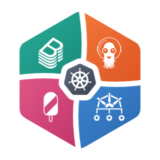
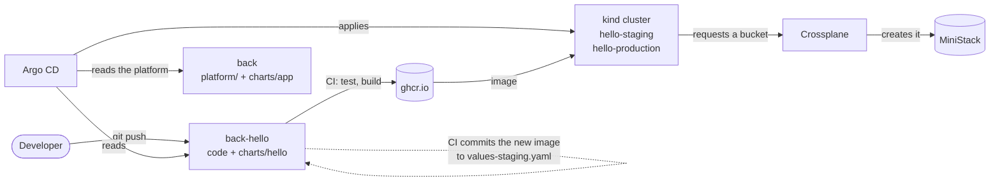

<div align="center">
  
  <h1>BACK lab</h1>
</div>

A local lab where Backstage, Argo CD, Crossplane and Kyverno are already wired together as an internal developer platform: ship a service the way a developer would, and change the APIs, the chart and the pipelines that made it that easy.

Everything runs on your machine, in a kind cluster, with MiniStack standing in for AWS. The only outside service involved is GitHub, where Argo CD reads what to deploy.

> Work in progress: Argo CD, the delivery path for services and the first platform APIs (buckets, queues, tables and caches, through Crossplane) are in place, and Kyverno is installed with no policy of its own yet; databases and Backstage are being added.

## What this is, and what it isn't

It's a lab. The four tools are already wired together, so you can use the platform they make and change it: ask it for a queue and watch what it becomes, or swap what a request is fulfilled with and watch nothing downstream notice.

What carries over to a real platform is the shape of it: the contracts between the tools, the APIs, the chart, and who owns what. What doesn't is the infrastructure underneath, which is a stage set: one node, no TLS, local accounts instead of single sign-on, and an AWS emulator that no longer gets updates. [Decisions](docs/decisions.md) says what a company would do instead, where the difference matters.

It isn't a course either. It doesn't teach each tool from scratch; their own documentation does that better.

## Using it, and changing it

Two halves, and they want different things from you. Both assume the lab is running, which is the next section.

### Using the platform

Argo CD, the services and what they asked for. `kubectl apply -f platform/apis/queue/example.yaml` asks for a queue the way a service would, `crossplane resource trace queues.back.lab emails -n hello-staging` shows what the platform made of it, and hello's page shows what it was given: its version, its size, and whether it reaches its bucket. As `dev`, you see the cluster the way a developer would, and you can't change it.

### Changing the platform

The loop, in the order you'd reach for it:

- `just render <api>` takes one of the folders under `platform/apis/` (`bucket`, `queue`, `table`, `cache`) and prints what that request would create, in a second and without a cluster, checked against the schemas.
- `just render-service [path]` does the same for a service through the platform's chart, for every stage, the way CI validates a pull request. Without an argument it renders `../back-hello/charts/hello`.
- `just diff <app>` takes an Argo CD Application (`apis` delivers the APIs above; `kubectl -n argocd get applications` lists them all) and shows what applying its folder from here would change in the cluster.
- `just local <app>` applies it instead of what Git says, and `just gitops` hands it back.

One thing doesn't bend: a change to `charts/app` reaches the cluster by push. Argo CD syncs only single-source Applications from disk, and a service's has two, the chart here and the service's own values. `just render-service` is the fast half of that loop, and your own forks, further down, are the other half.

[Things to try](docs/experiments.md) walks both and says what you should see, and [when something doesn't work](docs/troubleshooting.md) is the order to look in.

## Run it

Tested on Ubuntu 24.04 and Omarchy, where `setup.sh` also installs what's missing; the rest of the Arch family installs the same way. On other systems it runs the same checks and tells you what to install.

```sh
git clone https://github.com/hvpaiva/back.git && cd back
./setup.sh   # checks this machine and offers to install what's missing, asking first
just up      # creates the cluster and waits until everything is healthy (a few minutes)
```

`setup.sh` checks Docker, free ports (80, 443, 4566), RAM, disk and the tools pinned in `mise.toml`, and can add a line to your shell rc that activates [mise](https://mise.jdx.dev). Joining the `docker` group, which it offers to do, is equivalent to root on that machine: anyone in it can start a container that mounts the whole filesystem. If mise isn't active in your shell, prefix commands with `mise exec --`, as in `mise exec -- just up`.

| What | Where |
|---|---|
| Argo CD | http://argocd.localhost (user `dev` or `platform-admin`, password from `just argocd-password <user>`) |
| kubectl | From this directory: `kubectl --context dev` or `--context platform-admin` |
| Headlamp | http://headlamp.localhost (token from `just headlamp-token`) |
| Crossview | http://crossview.localhost (the requests, what each composed, and the providers behind them) |
| hello | http://hello.staging.localhost and http://hello.localhost |
| Traefik | http://traefik.localhost/dashboard/ |
| The cloud account | http://stackport.localhost (what the platform created in it), or `aws s3 ls` from this directory |
| Crossplane | Crossview, above, or `kubectl get providers,functions` |

`just` lists every recipe, and `just down` deletes the cluster. The lab uses about 5 GB of RAM and 8 GB of disk.

Run this way, the lab follows the repositories above on GitHub: everything works and you can inspect all of it. Argo CD reads GitHub rather than your disk, so changing what it deploys means either handing one folder to your working copy with `just local`, or running from your own forks, further down.

## What's already here

Two perspectives on the same cluster, each with an identity to see it through: `dev`, a developer in `team-a`, and `platform-admin`.

### A developer shipping a service

[hello](https://github.com/hvpaiva/back-hello) is a small service that displays its own version. Its repository holds the code and a short description of what it needs from the platform: name, team, port, size, whether it's public, and a bucket. A push to its `staging` branch builds an image and deploys it to staging. A pull request from `staging` to `main` promotes that same image to production. Pull requests are checked against the platform's rules before the merge. The developer never touches the cluster, never writes a Kubernetes manifest or a Dockerfile, and never creates the bucket: the platform does, and hands the service its details. As `dev`, Argo CD shows only the services, and kubectl reads the team's namespaces without being able to change them.

<p align="center">
  
  
</p>

### The platform behind it

Argo CD installs and upgrades everything from Git, itself included. One chart turns what a service declares into Deployments, Services and routes, with the platform's defaults for probes, resources and security. Workflows the platform maintains, called from each service's CI, check, validate, build and ship every service the same way. Argo CD projects decide what each team may deploy, and where. Crossplane serves the platform's own APIs: a service's request for a bucket becomes an S3 bucket in the lab's cloud account, with the platform's defaults. As `platform-admin`, you see all of it.



[How it works](docs/how-it-works.md) follows both sides in detail, from the push to the running pods.

## Run it from your own GitHub

Watching a change flow through the lab means pushing to repositories Argo CD watches, so you need your own copies. These steps are on you; the lab can't do them:

1. Fork [back](https://github.com/hvpaiva/back) and [back-hello](https://github.com/hvpaiva/back-hello). When forking back-hello, uncheck *Copy the main branch only*: the lab deploys its `staging` branch too.
2. Turn on GitHub Actions in your back-hello fork. GitHub disables workflows in forks; the Actions tab has the button.
3. Point the lab at your forks, from a clone of your back fork:
   ```sh
   just use-fork <your-github-user>   # rewrites the repository URLs in platform/ and commits
   git push
   ```
4. Start the lab with `just up`, or run `just argocd` if it's already running.

Then push a change to your back-hello `staging` branch. CI builds `ghcr.io/<you>/back-hello` and commits the new image, and within a minute or so Argo CD rolls it out: the page at http://hello.staging.localhost reloads with the new version. If the pods can't pull the image, GitHub created the package as private; make it public in the package settings.

### Deploy status in GitHub (optional)

Argo CD can report each deployment back to GitHub: the deployed commit gets an `argocd/<service>-<stage>` status, and your back-hello's Deployments list staging and production with their addresses. It signs in as a GitHub App, which you create once:

1. At https://github.com/settings/apps/new, name the app, set any homepage URL, uncheck *Webhook → Active*, and give it *Read and write* access to *Commit statuses* and *Deployments*.
2. On the app's page, note the *App ID* and generate a private key. A `.pem` file downloads.
3. Install the app on your account, for your back-hello fork only. The number at the end of the installation's URL is the *Installation ID*.
4. Copy `.env.example` to `.env`, fill in the three values, and run `just notifications`. `just up` repeats that step whenever it recreates the cluster.

## How it's put together

| Repository | What it holds |
|---|---|
| [back](https://github.com/hvpaiva/back) (this one) | The platform: the cluster's base layer, everything Argo CD delivers, and the chart services use |
| [back-hello](https://github.com/hvpaiva/back-hello) | A sample service: its code, its CI and its deploy configuration |

In this repository:

- `cluster/` is the base layer, what an infrastructure team would hand over: a cluster, an ingress controller and a cloud account (MiniStack, standing in for AWS). `just` installs it.
- `platform/` is everything Argo CD delivers. `platform/root.yaml`, applied by hand once with the projects, delivers `platform/apps/`: Argo CD itself, Headlamp, Crossplane, CloudNativePG, the cluster's RBAC, the platform's APIs, the projects and the services' ApplicationSet. `platform/crossplane/` holds Crossplane's packages, its permissions and its connection to the cloud account, and `platform/crossview/` the read access the UI over it runs with; `platform/apis/` holds the APIs services request resources through, each with the example request `just render` and `kubectl apply` take; `platform/rbac/` says what each team can see.
- `charts/app/` is the golden path for services, and `build/` has the Dockerfiles their images are built with. `.github/workflows/` holds the workflows services' CI calls: `go.yaml` checks Go services, `delivery.yaml` validates and ships any service.
- `scripts/` holds what the longer `just` recipes run.
- `docs/` explains [how it works](docs/how-it-works.md), suggests [things to try](docs/experiments.md), gives the order to look in [when something doesn't work](docs/troubleshooting.md), collects [notes on the problems we ran into](docs/platform-notes.md), and records [why it's built this way](docs/decisions.md).

## Isolation

Inside this directory, `mise.toml` points kubectl, helm and the argocd CLI at the lab cluster only, and keeps their credentials in git-ignored folders here rather than in your home directory. AWS calls go to the lab's cloud account with dummy credentials, even if real AWS profiles are configured, and so do those of Crossplane's AWS provider in the cluster. Host ports are bound to 127.0.0.1, so nothing is reachable from your network.
