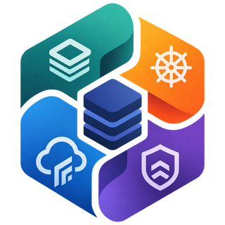
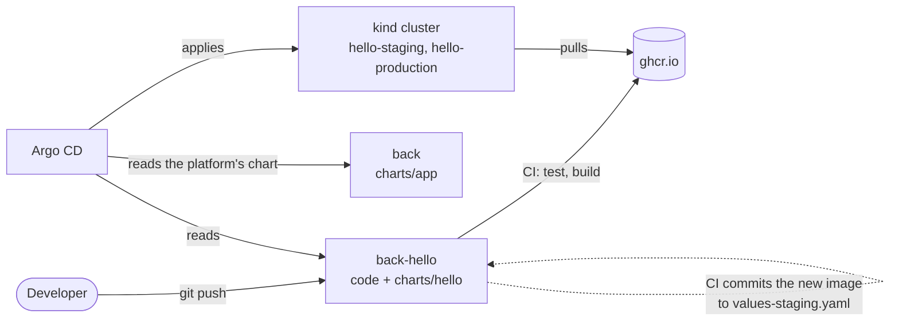

<div align="center">
  
  <h1>BACK lab</h1>
</div>

A local lab that shows how Backstage, Argo CD, Crossplane and Kyverno fit together as an internal developer platform: what a developer does to ship a service, what the platform team builds so that it takes so little, and what happens in between.

Everything runs on your machine, in a kind cluster, with LocalStack standing in for AWS. The only outside service involved is GitHub, where Argo CD reads what to deploy.

> Work in progress: Argo CD and the delivery path for services are in place; Crossplane, Kyverno and Backstage are being added.

## What this is, and what it isn't

It's a reference setup you can run, poke at and read. It makes the connections between the tools visible, along with the rough edges a platform team hits when putting them together.

It isn't a course. It doesn't teach each tool from scratch; their own documentation does that better. It isn't production-ready either: one node, no TLS, admin credentials, and an AWS emulator that no longer gets updates.

## What you'll see

Two perspectives on the same cluster.

### A developer shipping a service

[hello](https://github.com/hvpaiva/back-hello) is a small service that displays its own version. Its repository holds the code and a short description of what it needs from the platform: name, team, port, size, and whether it's public. A push to its `staging` branch builds an image and deploys it to staging. A pull request from `staging` to `main` promotes that same image to production. Pull requests are checked against the platform's rules before the merge. The developer never touches the cluster and never writes a Kubernetes manifest.

<p align="center">
  
  
</p>

### The platform behind it

Argo CD installs and upgrades everything from Git, itself included. One chart turns what a service declares into Deployments, Services and routes, with the platform's defaults for probes, resources and security. Workflows the platform maintains, called from each service's CI, check, validate, build and ship every service the same way. Argo CD projects decide what each team may deploy, and where.



## Run it

Tested on Ubuntu 24.04, where `setup.sh` also installs what's missing. On other systems it runs the same checks and tells you what to install.

```sh
git clone https://github.com/hvpaiva/back.git && cd back
./setup.sh   # checks this machine and offers to install what's missing, asking first
just up      # creates the cluster and waits until everything is healthy (a few minutes)
```

`setup.sh` checks Docker, free ports (80, 443, 4566), RAM, disk and the tools pinned in `mise.toml`, and can add a line to your shell rc that activates [mise](https://mise.jdx.dev). If mise isn't active in your shell, prefix commands with `mise exec --`, as in `mise exec -- just up`.

| What | Where |
|---|---|
| Argo CD | http://argocd.localhost (user `admin`, password from `just argocd-password`) |
| Headlamp | http://headlamp.localhost (token from `just headlamp-token`) |
| hello | http://hello.staging.localhost and http://hello.localhost |
| Traefik | http://traefik.localhost/dashboard/ |
| LocalStack | http://localhost:4566 |

`just` lists every recipe, and `just down` deletes the cluster. The lab uses about 2 GB of RAM and 5 GB of disk.

Run this way, the lab follows the repositories above on GitHub. Everything works and you can inspect all of it, but you can't change what it deploys: Argo CD reads GitHub, not your disk.

## Run it from your own GitHub

Watching a change flow through the lab means pushing to repositories Argo CD watches, so you need your own copies. These steps are on you; the lab can't do them:

1. Fork [back](https://github.com/hvpaiva/back) and [back-hello](https://github.com/hvpaiva/back-hello). When forking back-hello, uncheck *Copy the main branch only*: the lab deploys its `staging` branch too.
2. Turn on GitHub Actions in your back-hello fork. GitHub disables workflows in forks; the Actions tab has the button.
3. Point the lab at your forks, from a clone of your back fork:
   ```sh
   just use-fork <your-github-user>   # rewrites the repository URLs in platform/ and commits
   git push
   ```
4. Start the lab with `just up`, or run `just argocd` if it's already running.

Then push a change to your back-hello `staging` branch. CI builds `ghcr.io/<you>/back-hello` and commits the new image, and within a minute or so Argo CD rolls it out: the page at http://hello.staging.localhost reloads with the new version. If the pods can't pull the image, GitHub created the package as private; make it public in the package settings.

### Deploy status in GitHub (optional)

Argo CD can report each deployment back to GitHub: the deployed commit gets an `argocd/<service>-<stage>` status, and your back-hello's Deployments list staging and production with their addresses. It signs in as a GitHub App, which you create once:

1. At https://github.com/settings/apps/new, name the app, set any homepage URL, uncheck *Webhook → Active*, and give it *Read and write* access to *Commit statuses* and *Deployments*.
2. On the app's page, note the *App ID* and generate a private key. A `.pem` file downloads.
3. Install the app on your account, for your back-hello fork only. The number at the end of the installation's URL is the *Installation ID*.
4. Copy `.env.example` to `.env`, fill in the three values, and run `just notifications`. `just up` repeats that step whenever it recreates the cluster.

## How it's put together

| Repository | What it holds |
|---|---|
| [back](https://github.com/hvpaiva/back) (this one) | The platform: the cluster's base layer, everything Argo CD delivers, and the chart services use |
| [back-hello](https://github.com/hvpaiva/back-hello) | A sample service: its code, its CI and its deploy configuration |

In this repository:

- `cluster/` is the base layer, what an infrastructure team would hand over: a cluster, an ingress controller and a cloud account. `just` installs it.
- `platform/` is everything Argo CD delivers, starting with Argo CD itself. `platform/root.yaml` is the only thing applied by hand.
- `charts/app/` is the golden path for services. `.github/workflows/` holds the workflows services' CI calls: `go.yaml` checks Go services, `delivery.yaml` validates and ships any service.
- `docs/` explains [how it works](docs/how-it-works.md), collects [notes on the problems we ran into](docs/platform-notes.md), and records [why it's built this way](docs/decisions.md).

## Isolation

Inside this directory, `mise.toml` points kubectl, helm and the argocd CLI at the lab cluster only, and keeps their credentials in git-ignored folders here rather than in your home directory. AWS calls go to LocalStack with dummy credentials, even if real AWS profiles are configured. Host ports are bound to 127.0.0.1, so nothing is reachable from your network.
